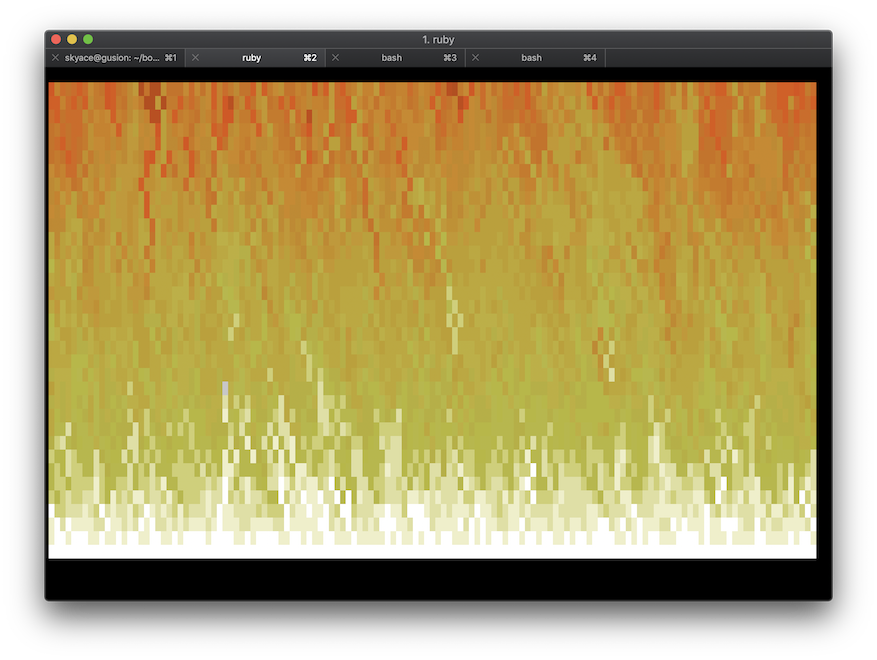

[](https://travis-ci.org/marcinruszkiewicz/doomfire)
[](https://badge.fury.io/rb/doomfire)

# Doomfire

Put your terminal on fire.



This gem implements the [Doom fire algorithm](https://fabiensanglard.net/doom_fire_psx/) in Ruby, because why not, and outputs it into the terminal. Right now it requires the terminal to be able to display 24-bit colors, so it will either not work at all or not work properly on terminals that can't do that, for example on MacOS's default `Terminal.app` - in which case you should probably install a better terminal application (like [iTerm](https://www.iterm2.com) or whatever else you like).

You can check the list of terminals supporting 24-bit color [here](https://github.com/termstandard/colors).

## Installation

Add this line to your application's Gemfile:

```ruby
gem 'doomfire'
```

And then execute:

    $ bundle

Or install it yourself as:

    $ gem install doomfire

## Usage

The most basic way to run this is to run it directly from the command line:

    $ doomfire

Pressing `CTRL`-`C` will stop the program gracefully after a few extra frames to let it end nicely.

Alternatively you can use it for amusement while running some long rake tasks.

```ruby
require 'doomfire'

desc 'some long running task'
task :long do
  fire = Doomfire::Terminal.new
  fire.run

  5.times do
    sleep 1
  end

  fire.stop
end
```

This will run the fire in a separate thread while your rake tasks works in the main thread, and at the end of the task it will gracefully extinguish the fire and clear the terminal.

## Contributing

Bug reports and pull requests are welcome on GitHub at https://github.com/marcinruszkiewicz/doomfire.

## License

The gem is available as open source under the terms of the [MIT License](https://opensource.org/licenses/MIT).
